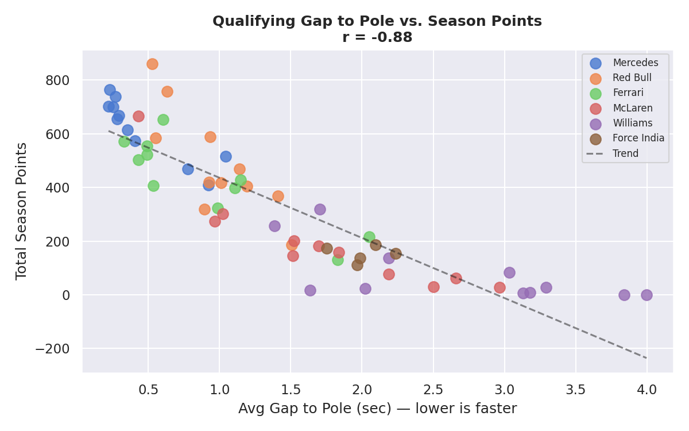

# PitWall Intelligence

> **Predictive Modeling of Formula 1 Constructor Performance and Sponsorship Value Using Machine Learning**

A data-driven Brand Value Index (BVI) for Formula 1 constructors, combining machine-learning performance prediction with SHAP-based explainability — quantifying what is currently a USD 1.8 billion sponsorship market priced largely on perception.

---

## Problem

Formula 1's sponsorship market exceeds USD 1.8 billion annually, with a global audience above 400 million viewers across broadcast, streaming, and digital channels. Yet sponsorship valuation in the sport still relies on brand-perception surveys, media-impression estimates, and subjective prestige scoring. There is no publicly available analytical framework that converts on-track performance into an interpretable, comparable, sponsor-facing metric.

## Research question

> Can explainability techniques applied to structured ML models trained on complete historical race data produce an interpretable composite score of F1 sponsorship value that discriminates between constructors?

## Brand Value Index (BVI)

Two-dimensional composite, season-normalised per constructor:

| Dimension | Weight | Components |
|---|---|---|
| **Performance** | 60% | Predicted championship points · podium probability |
| **Consistency** | 40% | Reliability indicators · qualifying-to-race delta |

Min-max normalisation within each season ensures dominant-era seasons do not suppress midfield-team scores in cross-season comparison.

## Headline findings

### Sprint 1 — qualifying pace correlates with season points

Average qualifying gap-to-pole correlates with total constructor points at **Pearson r = -0.787** across 112 team-seasons (full-population figure; the top-6 sub-population only is r = -0.887). Qualifying pace anchors the BVI Performance dimension.

### Sprint 2 — Gradient Boosting reaches R^2 = 0.95 cross-validated

Three regression models trained on 2014-2023 (102 team-seasons) and evaluated on the held-out 2024 season (10 team-seasons):

| Model | CV RMSE | CV R^2 | Test RMSE | Test R^2 |
|---|---|---|---|---|
| Linear Regression | 53.6 | 0.933 | 50.7 | 0.959 |
| Decision Tree (d=5) | 71.6 | 0.885 | 96.3 | 0.851 |
| **Gradient Boosting** | **46.6** | **0.949** | **50.4** | **0.959** |

Permutation importance from the Gradient Boosting model (mean drop in R^2 when feature is permuted, n_repeats = 30):

| Feature | Importance |
|---|---|
| `avg_grid` | **1.017** |
| `avg_qual_gap_to_pole` | 0.106 |
| `pole_count` | 0.060 |
| `avg_qual_to_race_delta` | 0.039 |
| `dnf_rate` | 0.003 |
| `season` | 0.001 |
| `races_entered` | 0.001 |

Average grid position alone accounts for almost the entire explained variance. The other six features combined contribute roughly a fifth as much, validating the proposed BVI weighting (60% Performance / 40% Consistency).

## Dataset

Single source — **[Jolpica-F1 API](https://api.jolpi.ca/ergast/)**, an actively maintained mirror of the Ergast Developer API for Formula 1. No Kaggle imports, no third-party aggregators, no synthetic data. Every record is fetched live and cached as JSON for reproducibility.

**Focal era:** V6 hybrid, 2014-2024. (2025 ingestion deferred to Sprint 3.)

| Table | Rows | Coverage |
|---|---|---|
| `races` | 228 | Grands Prix, 2014-2024 |
| `results` | 4,626 | Race finishing data |
| `qualifying` | 4,610 | Q1 / Q2 / Q3 session times |
| `constructor_standings` | 112 | Constructor-season finals |
| `driver_standings` | 247 | Driver-season finals |
| `team_season_stats` | 112 | Sprint 2 — aggregated per-team-per-season metrics |
| `team_season_features` | 112 | Sprint 2 — modeling feature matrix (7 features + target) |
| `constructors` · `drivers` | — | Team and driver metadata |

## Tech stack

`Python 3.11` · `requests` · `tenacity` · `pandas` · `numpy` · `SQLite` · `scikit-learn` · `joblib` · `shap` · `matplotlib` · `seaborn` · `plotly` · `streamlit`

**Environment:** Google Colab · Jupyter · VS Code

## Sprint plan

| # | Window | Focus | Status |
|---|---|---|---|
| 1 | 23 Apr - 4 May | ETL pipeline · preprocessing · EDA | Complete |
| 2 | 5 May - 18 May | Baseline + advanced models | Complete (9 May) |
| 3 | 19 May - 1 Jun | BVI synthesis · SHAP · podium classifier · 2025 ingestion | Planned |
| 4 | 2 Jun - 15 Jun | Streamlit dashboard | Planned |
| 5 | 16 Jun - 22 Jun | Report polish · viva prep | Planned |

**Final report due:** 22 June 2026 · **Defence:** 6 July 2026

## Sprint 1 - key findings

1. **Qualifying speed is the strongest single predictor of season points.** Pearson r = -0.787 across 112 team-seasons (p < 0.001), anchoring qualifying pace as a primary Performance input.
2. **The era is defined by sustained dominance.** Mercedes won eight consecutive Constructors Championships (2014-2021), followed by Red Bull (2022, 2023) and McLaren (2024).
3. **Constructor rank volatility varies sharply.** Williams (sigma = 2.83) and McLaren (sigma = 2.44) are the most volatile across the era; Force India (sigma = 0.84), Red Bull (sigma = 0.92), and Mercedes (sigma = 1.04) are the most stable.
4. **Season concentration ranges from 0.503 (2020, most competitive) to 0.619 (2016, most concentrated)**, era-wide mean Gini 0.556.

## Sprint 2 - key findings

1. **Gradient Boosting is the strongest model.** CV R^2 = 0.949 (RMSE 46.6), held-out 2024 R^2 = 0.959 (RMSE 50.4). Linear Regression matches the test R^2 but produces physically impossible negative point predictions for backmarker constructors.
2. **Average grid position dominates.** Permutation importance of 1.017 - permuting it alone removes essentially all the model explanatory power. All other features combined contribute approximately 0.21.
3. **Linear coefficients are unreliable on this dataset.** Three features (avg_grid, avg_qual_gap_to_pole, pole_count) all encode qualifying pace and are highly collinear; Linear Regression coefficient signs are not interpretable. Permutation importance and SHAP (Sprint 3) are the right attribution tools here.
4. **Both models systematically misprice Ferrari and Red Bull 2024.** Both overpredict Ferrari (~110 points) and Red Bull (~87 points by GBR). Within-season trajectory features are scoped for Sprint 3.

## Reproducing the project

    git clone https://github.com/DevDharmik/Pitwall-intelligence.git
    cd Pitwall-intelligence
    pip install -r requirements.txt

Open notebooks in order in Colab or Jupyter:

1. `notebooks/01_etl_jolpica.ipynb` - populates `data/pitwall.db` from Jolpica.
2. `notebooks/02_preprocessing.ipynb` - builds analytical tables.
3. `notebooks/03_eda.ipynb` - generates the figures.
4. `notebooks/04_features.ipynb` - persists `team_season_stats` and `team_season_features`.
5. `notebooks/05_baselines.ipynb` - LinearRegression and DecisionTree, 5-fold CV, held-out 2024.
6. `notebooks/06_advanced.ipynb` - GradientBoostingRegressor with permutation importance.

Random state 42 throughout. Feature engineering, train/test split, K-Fold cross-validation, and model fitting are deterministic.

## Author

**Dharmik Champaneri** - Student ID 20327984
M.Sc. Data Science · University of Europe for Applied Sciences (Berlin / Potsdam)
**Supervisor:** Dr. Humera Noor Minhas
**Module:** Capstone Project · 2026

## License

[MIT License](LICENSE) for code. Reports and figures licensed under [CC-BY-4.0](https://creativecommons.org/licenses/by/4.0/).
